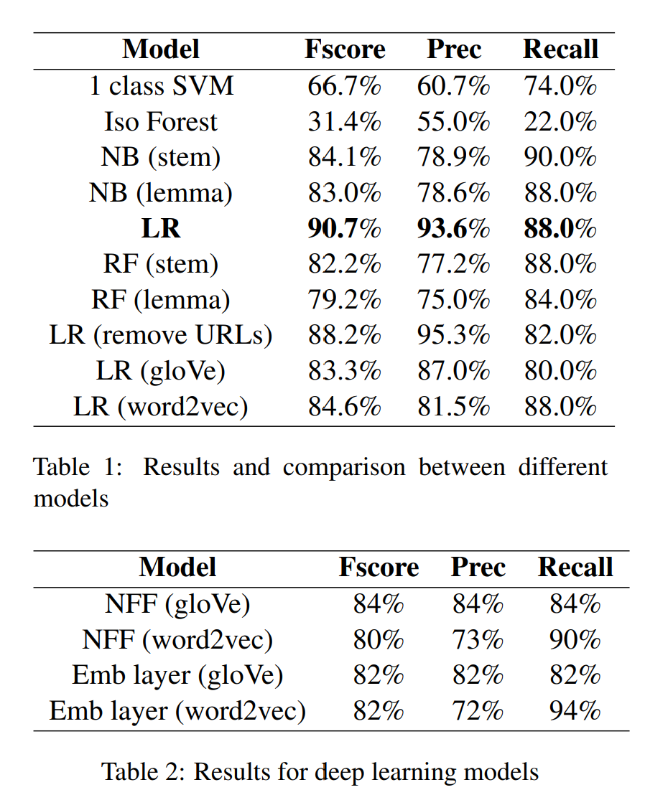

# Portfolio

## Machine Learning

### Climate Change Misinformation Detection

My complete implementation of year end project in [***COMP90042: Natural Language Processing***](https://handbook.unimelb.edu.au/2020/subjects/comp90042) by University of Melbourne (2020).

---
### NLP Assignments

My solutions for the assignments in [***COMP90042: Natural Language Processing***](https://handbook.unimelb.edu.au/2020/subjects/comp90042) by University of Melbourne (2020).

The first one is about text preprocessing and classification on rumour data on Twitter. My task is to predict, given a tweet and its reactions, whether it is a rumour or not. I first need to create training, development and test partitions from the preprocessed events and convert the bag-of-words representation into feature vectors. After that, I implement two text classifiers: Naive Bayes and Logistic Regression, tune the hyper-parameters of these classifiers and print the task performance for different hyper-parameter settings.

For the second assignment, I will be quantifying the similarity between pairs of words of a dataset using different methods with the word co-occurrence in the Brown corpus and synset structure of WordNet. Firstly, I will preprocess the dataset to filter out the rare and ambiguous words. Secondly, I will calculate the similarity scores for pairs of words in the filtered dataset using Lin similarity, NPMI and LSA. Lastly, I will quantify how well these methods work by comparing to a human annotated gold-standard.

For the detailed solution codes, you can use the github links above.

---
### Potential Donators
My implementation and report of final year project in [***MAST90107: Data Science Project***](https://handbook.unimelb.edu.au/2020/subjects/mast90107) by University of Melbourne (2020).

---
[Project 2 Title](/pdf/sample_presentation.pdf)

---
## Dashboards

### Paygate (Bill Payment)

---
### Digital Customers

---
### RFM Analysis

---

---

© 2024 Trung Nguyen. Powered by Jekyll and the Minimal Theme.

